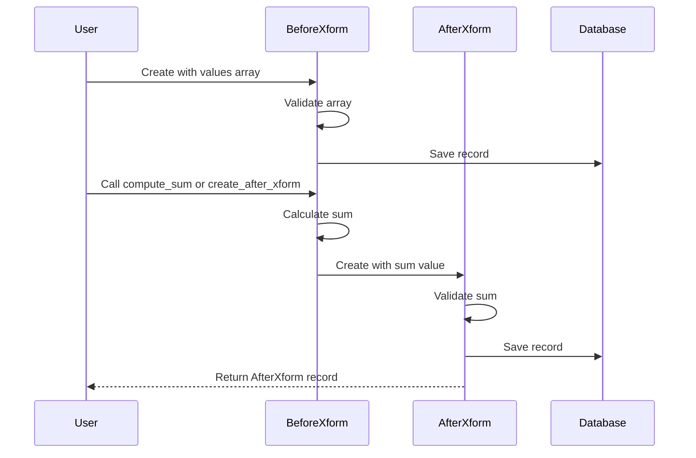

# Design Document

## Overview

This design implements a data transformation system for a Rails application using two ActiveRecord models: `BeforeXform` and `AfterXform`. The BeforeXform model stores arrays of numeric values, while the AfterXform model stores computed sums. The design leverages Rails 7.0 conventions, ActiveRecord serialization for array storage, and standard Rails associations to maintain relationships between the models.

## Architecture

### High-Level Architecture

```
┌─────────────────┐
│   Rails App     │
├─────────────────┤
│  Controllers    │
│  (optional)     │
├─────────────────┤
│    Models       │
│  ┌───────────┐  │
│  │BeforeXform│  │
│  └─────┬─────┘  │
│        │        │
│        │ has_one│
│        ▼        │
│  ┌───────────┐  │
│  │AfterXform │  │
│  └───────────┘  │
├─────────────────┤
│  ActiveRecord   │
├─────────────────┤
│   SQLite DB     │
└─────────────────┘
```

### Technology Stack

- Rails 7.0
- ActiveRecord ORM
- SQLite3 database
- ActiveRecord serialization for array storage

## Components and Interfaces

### 1. BeforeXform Model

**Purpose**: Store and manage arrays of numeric values before transformation.

**Attributes**:
- `id` (integer, primary key): Auto-generated unique identifier
- `values` (text, serialized as array): Array of numeric values
- `created_at` (datetime): Timestamp of record creation
- `updated_at` (datetime): Timestamp of last update

**Methods**:
- `compute_sum`: Instance method that calculates the sum of the values array
- Standard ActiveRecord methods (create, update, destroy, find, etc.)

**Validations**:
- Presence of `values` field
- Custom validation to ensure `values` is an array
- Custom validation to ensure all elements in `values` are numeric

**Associations**:
- `has_one :after_xform, dependent: :destroy`

### 2. AfterXform Model

**Purpose**: Store computed sum results from BeforeXform transformations.

**Attributes**:
- `id` (integer, primary key): Auto-generated unique identifier
- `sum` (decimal): The computed sum value
- `before_xform_id` (integer, foreign key): Reference to the source BeforeXform record
- `created_at` (datetime): Timestamp of record creation
- `updated_at` (datetime): Timestamp of last update

**Methods**:
- Standard ActiveRecord methods (create, update, destroy, find, etc.)

**Validations**:
- Presence of `sum` field
- Numericality of `sum` field
- Presence of `before_xform_id` (to ensure referential integrity)

**Associations**:
- `belongs_to :before_xform`

### 3. Transformation Service (Optional)

While not strictly required, a service object pattern could be used for complex transformation logic:

**Purpose**: Encapsulate the transformation logic from BeforeXform to AfterXform.

**Methods**:
- `transform(before_xform)`: Takes a BeforeXform instance, computes sum, creates AfterXform record

This can be implemented as a simple instance method on BeforeXform for the MVP.

## Data Models

### Database Schema

#### before_xforms table
```ruby
create_table :before_xforms do |t|
  t.text :values  # Serialized array
  t.timestamps
end
```

#### after_xforms table
```ruby
create_table :after_xforms do |t|
  t.decimal :sum, precision: 15, scale: 2
  t.references :before_xform, null: false, foreign_key: true
  t.timestamps
end

add_index :after_xforms, :before_xform_id, unique: true
```

### Data Flow



## Error Handling

### Validation Errors

1. **Invalid Array Data**:
   - Error: "Values must be an array"
   - Handling: Return validation error, prevent save

2. **Non-Numeric Array Elements**:
   - Error: "All values must be numeric"
   - Handling: Return validation error with details on invalid elements

3. **Missing Sum Value**:
   - Error: "Sum can't be blank"
   - Handling: Return validation error, prevent save

4. **Missing BeforeXform Reference**:
   - Error: "Before xform must exist"
   - Handling: Return validation error, prevent orphaned AfterXform records

### Runtime Errors

1. **Empty Array Handling**:
   - Behavior: Return sum of 0
   - No error raised

2. **Database Connection Errors**:
   - Handling: Let Rails handle with standard ActiveRecord error handling
   - Log errors for debugging

3. **Duplicate AfterXform Creation**:
   - Error: Unique index violation on before_xform_id
   - Handling: Return validation error or update existing record

## Testing Strategy

### Unit Tests

1. **BeforeXform Model**:
   - Test array serialization and deserialization
   - Test validation of array presence
   - Test validation of numeric elements
   - Test compute_sum method with various inputs (positive, negative, mixed, empty)
   - Test association with AfterXform

2. **AfterXform Model**:
   - Test sum field validation
   - Test numericality validation
   - Test belongs_to association
   - Test foreign key constraint

### Integration Tests

1. **Transformation Flow**:
   - Test creating BeforeXform and generating AfterXform
   - Test referential integrity between models
   - Test cascade deletion (when BeforeXform is deleted, AfterXform is also deleted)

2. **Edge Cases**:
   - Empty arrays
   - Large arrays (performance)
   - Very large numbers
   - Negative numbers
   - Decimal numbers

### Test Data Examples

```ruby
# Valid BeforeXform
{ values: [1, 2, 3, 4, 5] } # sum = 15

# Edge cases
{ values: [] } # sum = 0
{ values: [-5, 5] } # sum = 0
{ values: [1.5, 2.5, 3.0] } # sum = 7.0
{ values: [1000000, 2000000] } # sum = 3000000

# Invalid cases
{ values: nil } # validation error
{ values: "not an array" } # validation error
{ values: [1, "two", 3] } # validation error
```

## Implementation Notes

1. **Array Serialization**: Use ActiveRecord's `serialize` method to store arrays in a text column
2. **Precision**: The sum field uses `decimal(15,2)` to handle large numbers with precision
3. **Associations**: The `has_one` and `belongs_to` relationship ensures proper Rails conventions
4. **Unique Constraint**: The unique index on `before_xform_id` ensures one-to-one relationship
5. **Dependent Destroy**: When a BeforeXform is deleted, its associated AfterXform is automatically deleted
